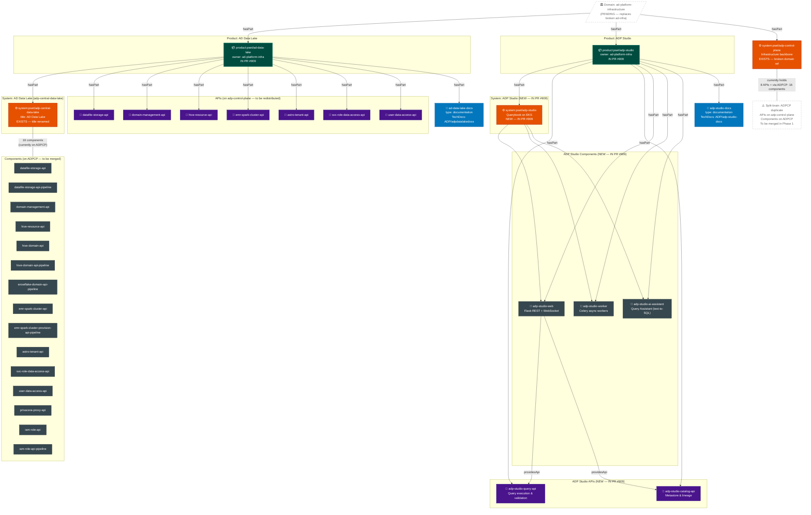
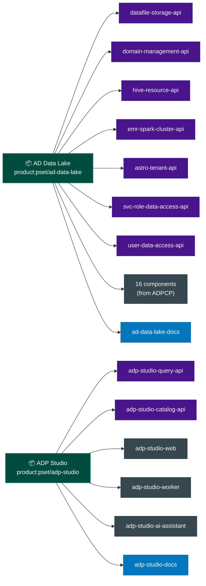
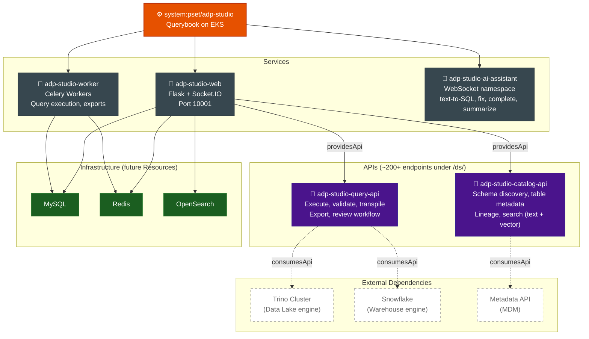
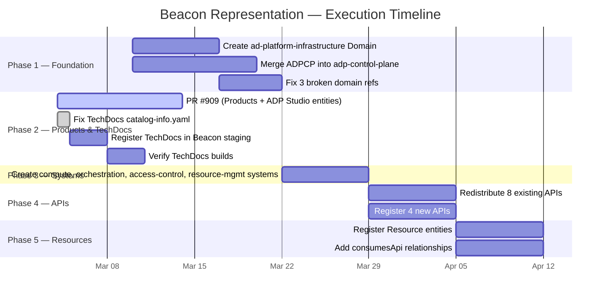

# AD Platform Infrastructure — Beacon Entity Relationship Map

**Last Updated:** 2026-03-04  
**PR:** [#909](https://git.autodesk.com/openatadsk/pset-software-catalog/pull/909)

---

## Full Entity Hierarchy

---

## Simplified View — Product → hasPart

---

## ADP Studio — Internal Architecture

---

## Phase Execution Status

---

## Legend

| Symbol | Meaning |
|--------|---------|
| 🏛 | Domain |
| 📦 | Product |
| ⚙️ | System |
| 🔧 | Component |
| 🔌 | API |
| 📄 | Documentation (TechDocs) |
| ⚠️ | Issue / needs attention |
| Dashed border | Pending / not yet created |
| Solid border | Exists or in PR #909 |
